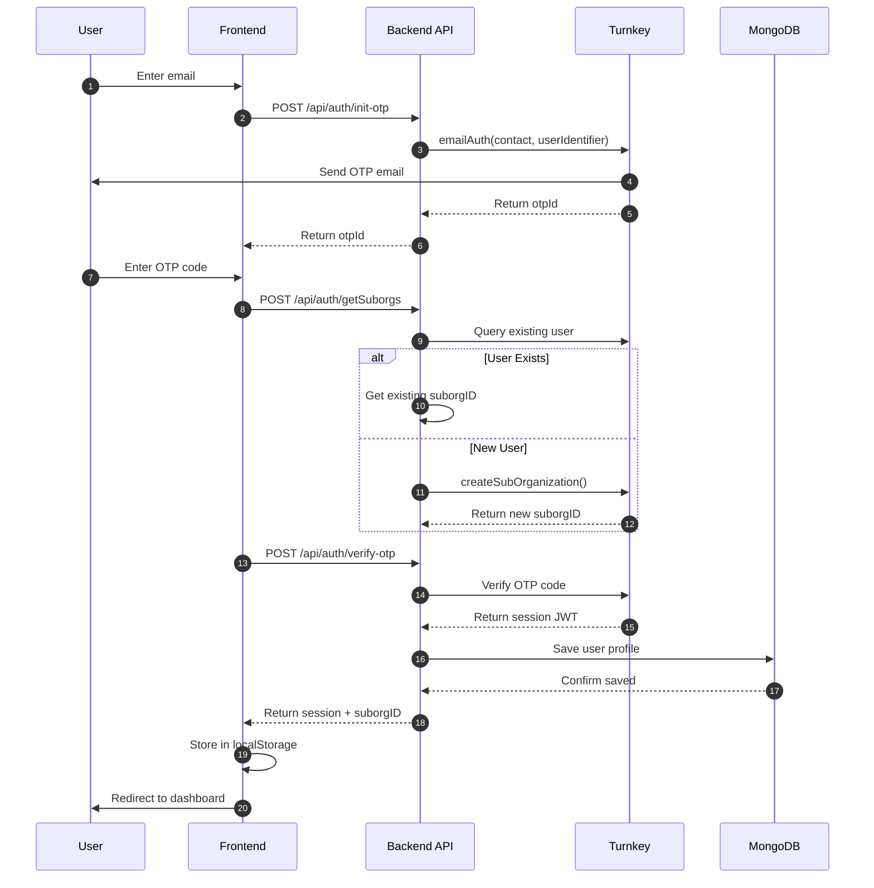
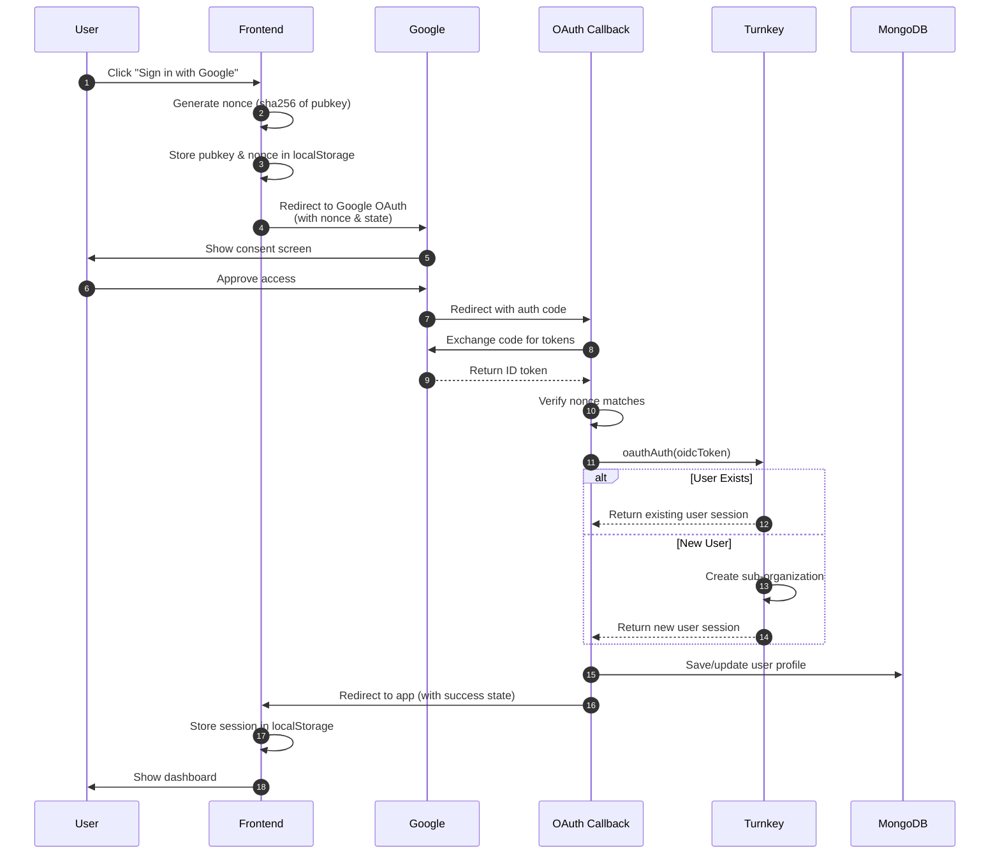
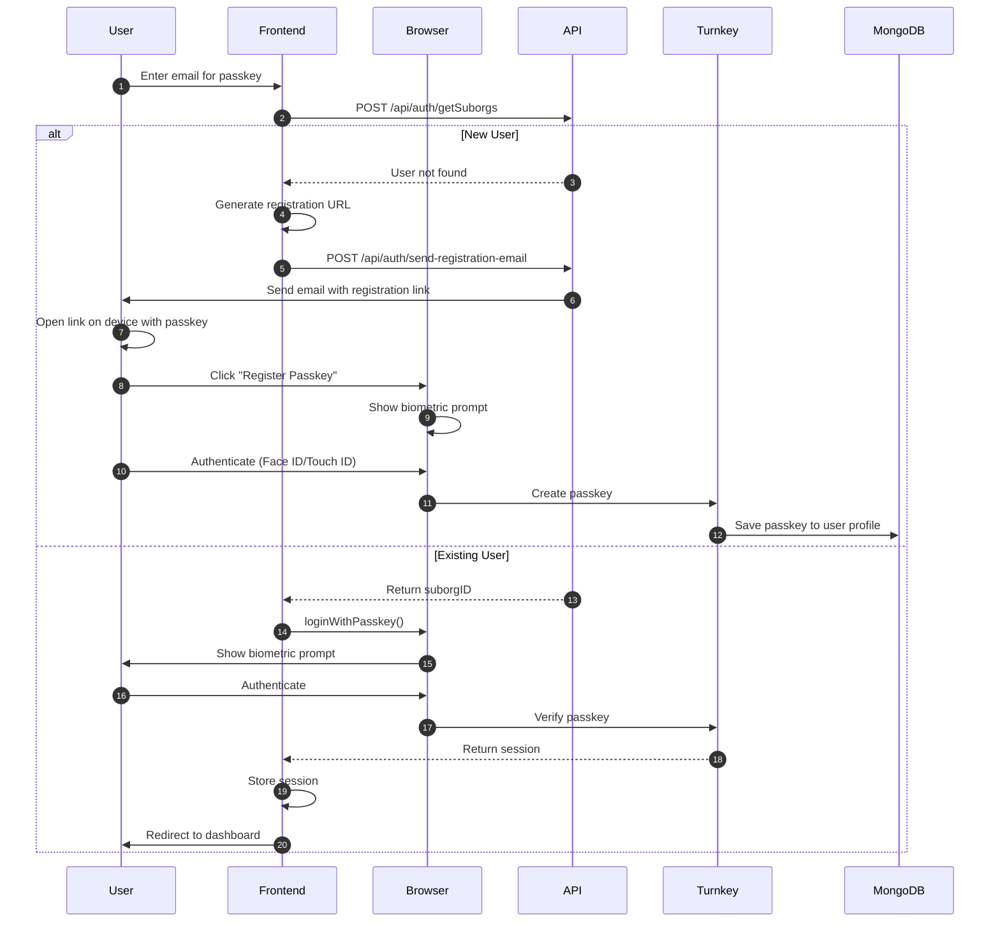
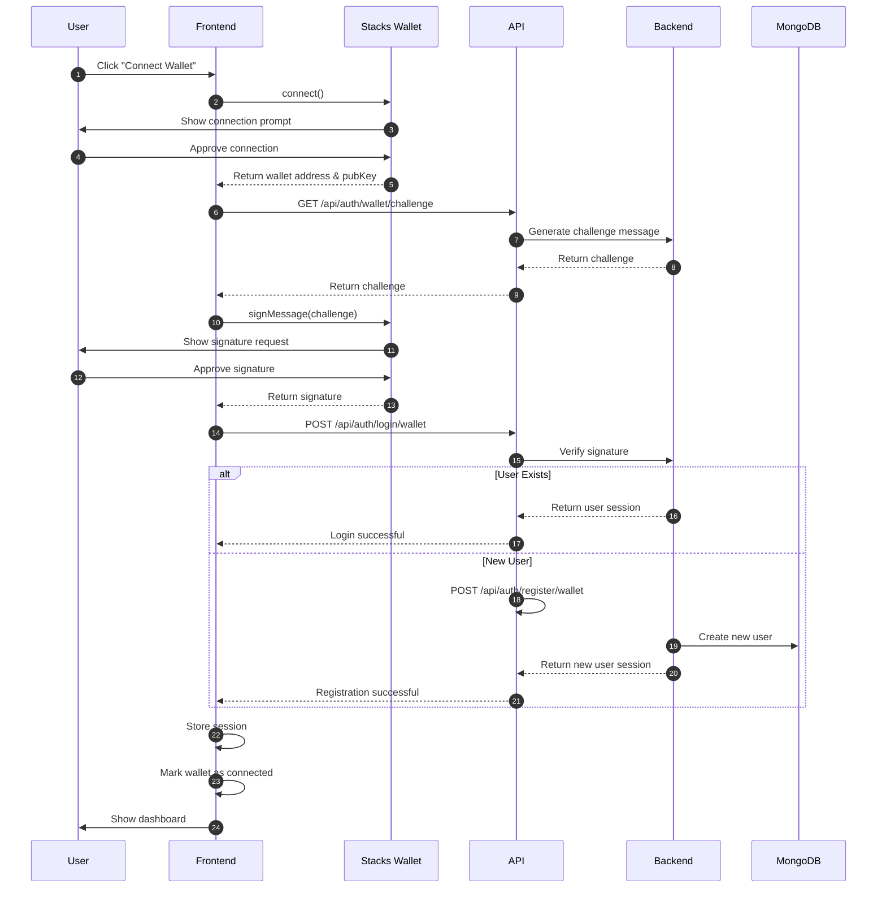
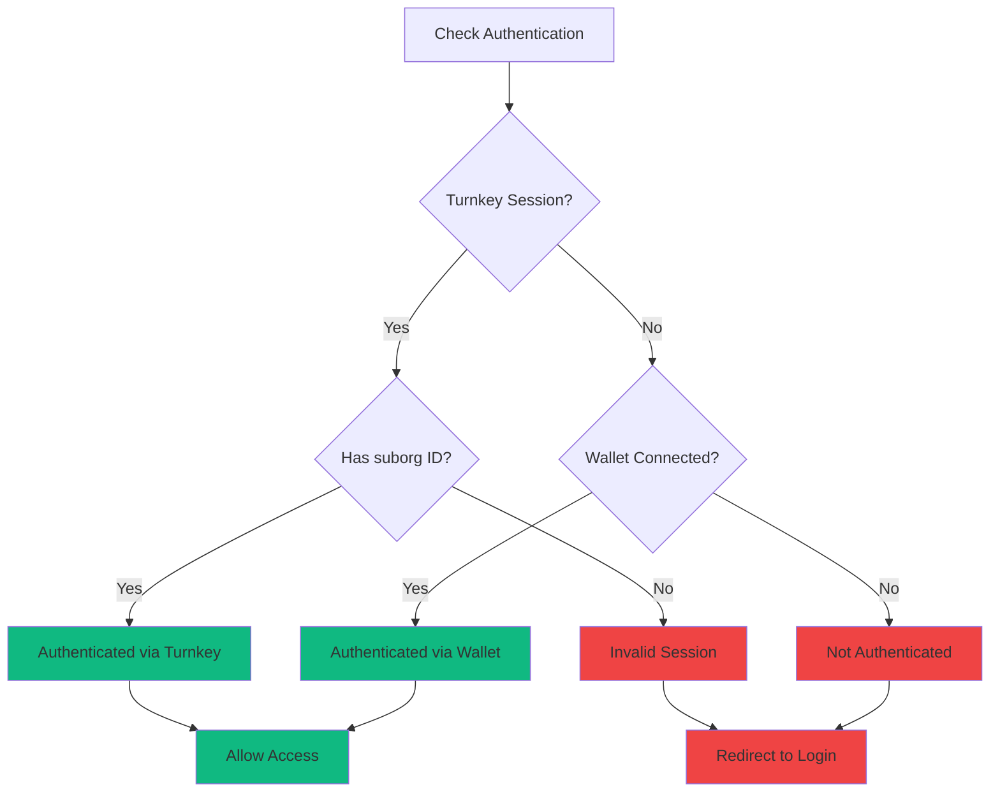

# Authentication Flow Documentation

## Overview

QuestFi supports multiple authentication methods through Turnkey's secure infrastructure:
- **Email OTP** (One-Time Password)
- **Google OAuth**
- **Passkey** (WebAuthn)
- **Wallet Connect** (Stacks wallets)

---

## Complete Authentication Architecture

```mermaid
graph TB
    subgraph "User Interface"
        A[Landing Page]
        B[Auth Modal]
        C[Profile Dashboard]
    end

    subgraph "Frontend Components"
        D[TurnkeyAuth.tsx]
        E[Navbar.tsx]
        F[OAuthCallbackHandler.tsx]
    end

    subgraph "API Routes"
        G[/api/auth/init-otp]
        H[/api/auth/verify-otp]
        I[/api/auth/google-callback]
        J[/api/auth/wallet/challenge]
        K[/api/auth/login/wallet]
        L[/api/auth/register/wallet]
    end

    subgraph "External Services"
        M[Turnkey API]
        N[Google OAuth]
        O[Stacks Wallet]
    end

    subgraph "Storage"
        P[(MongoDB)]
        Q[localStorage]
    end

    A --> B
    B --> D
    D --> G
    D --> I
    D --> K

    G --> M
    H --> M
    I --> N
    J --> O
    K --> O
    L --> O

    M --> P
    K --> P
    L --> P

    D --> Q
    Q --> E
    E --> C

    style A fill:#6366f1
    style M fill:#ec4899
    style P fill:#10b981
    style Q fill:#f59e0b
```

---

## 1. Email OTP Authentication

### Flow Diagram



### Implementation

```typescript
// 1. Initialize OTP
const initOtpResponse = await axios.post('/api/auth/init-otp', {
  contact: email,
  userIdentifier: pubKey,
  otpType: 'OTP_TYPE_EMAIL',
})

// 2. Check if user exists
const getSuborgsResponse = await axios.post('/api/auth/getSuborgs', {
  filterType: 'EMAIL',
  filterValue: email,
})

// 3. Verify OTP
const authResponse = await axios.post('/api/auth/verify-otp', {
  suborgID: userSuborgID,
  otpId,
  otpCode,
  targetPublicKey: pubKey,
})

// 4. Store session
localStorage.setItem('turnkey_session', session)
localStorage.setItem('turnkey_suborg_id', userSuborgID)
localStorage.setItem('user_email', email)
window.dispatchEvent(new Event('auth-changed'))
```

---

## 2. Google OAuth Authentication

### Flow Diagram



### Implementation

```typescript
// 1. Initiate OAuth
const googleAuthUrl = new URL('https://accounts.google.com/o/oauth2/v2/auth')
googleAuthUrl.searchParams.set('client_id', process.env.NEXT_PUBLIC_GOOGLE_CLIENT_ID)
googleAuthUrl.searchParams.set('redirect_uri', `${window.location.origin}/api/auth/google-callback`)
googleAuthUrl.searchParams.set('response_type', 'code')
googleAuthUrl.searchParams.set('scope', 'openid email profile')
googleAuthUrl.searchParams.set('nonce', nonce)
googleAuthUrl.searchParams.set('state', JSON.stringify({ returnTo: window.location.pathname }))

window.location.href = googleAuthUrl.toString()

// 2. Handle callback (backend)
const tokenResponse = await fetch('https://oauth2.googleapis.com/token', {
  method: 'POST',
  body: JSON.stringify({
    code,
    client_id: process.env.NEXT_PUBLIC_GOOGLE_CLIENT_ID,
    client_secret: process.env.GOOGLE_CLIENT_SECRET,
    redirect_uri,
    grant_type: 'authorization_code',
  }),
})

// 3. Verify and authenticate with Turnkey
const idToken = data.id_token
const session = await turnkeyClient.oauthAuth({ oidcToken: idToken })
```

---

## 3. Passkey Authentication (WebAuthn)

### Flow Diagram



### Implementation

```typescript
// New user registration
const registrationUrl = `${window.location.origin}/auth/register-passkey?email=${email}&publicKey=${pubKey}`

await axios.post('/api/auth/send-registration-email', {
  email,
  registrationUrl,
})

// Existing user login
await passkeyClient.loginWithPasskey({
  publicKey: pubKey,
})

localStorage.setItem('turnkey_suborg_id', userSuborgID)
localStorage.setItem('turnkey_session', 'passkey_authenticated')
localStorage.setItem('user_email', email)
```

---

## 4. Wallet Connect Authentication

### Flow Diagram



### Implementation

```typescript
// 1. Connect wallet
const walletData = await walletService.connectWallet()

// 2. Get challenge
const challengeResponse = await fetch(`/api/auth/wallet/challenge?address=${walletData.address}&type=connection`)
const { challenge } = await challengeResponse.json()

// 3. Sign challenge
const signatureData = await walletService.signMessage(challenge)

// 4. Try login first
const loginResponse = await fetch('/api/auth/login/wallet', {
  method: 'POST',
  headers: { 'Content-Type': 'application/json' },
  body: JSON.stringify({
    address: walletData.address,
    signature: signatureData.signature,
    message: challenge,
    publicKey: signatureData.publicKey,
  }),
})

// 5. If user doesn't exist, register
if (loginResult.error?.includes('not found')) {
  const registerResponse = await fetch('/api/auth/register/wallet', {
    method: 'POST',
    headers: { 'Content-Type': 'application/json' },
    body: JSON.stringify({
      address: walletData.address,
      signature: signatureData.signature,
      message: challenge,
      publicKey: signatureData.publicKey,
    }),
  })
}

// 6. Store session
localStorage.setItem('wallet_address', walletData.address)
localStorage.setItem('wallet_connected', 'true')
window.dispatchEvent(new Event('auth-changed'))
```

---

## Session Management

### localStorage Structure

```typescript
// Turnkey Auth
localStorage.setItem('turnkey_session', 'jwt_token_here')
localStorage.setItem('turnkey_suborg_id', 'suborg_id_here')
localStorage.setItem('user_email', 'user@example.com')

// Wallet Auth
localStorage.setItem('wallet_address', 'ST2F3J1PK46D6XVRBB9SQ66PY89P8G0EBDW5E05M7')
localStorage.setItem('wallet_connected', 'true')
```

### Auth State Detection



### Auth Event System

```typescript
// Listen for auth changes
window.addEventListener('auth-changed', () => {
  const session = localStorage.getItem('turnkey_session')
  const suborgId = localStorage.getItem('turnkey_suborg_id')
  const walletConnected = localStorage.getItem('wallet_connected')

  if ((session && suborgId) || walletConnected === 'true') {
    setIsAuthenticated(true)
  } else {
    setIsAuthenticated(false)
  }
})

// Dispatch after authentication
window.dispatchEvent(new Event('auth-changed'))
```

---

## API Endpoints

### Authentication Endpoints

| Endpoint | Method | Purpose |
|----------|--------|---------|
| `/api/auth/init-otp` | POST | Initialize email OTP |
| `/api/auth/verify-otp` | POST | Verify OTP and create session |
| `/api/auth/getSuborgs` | POST | Check if user exists |
| `/api/auth/createSuborg` | POST | Create new Turnkey sub-org |
| `/api/auth/google-callback` | GET | Handle Google OAuth callback |
| `/api/auth/wallet/challenge` | GET | Generate wallet signature challenge |
| `/api/auth/login/wallet` | POST | Login with wallet signature |
| `/api/auth/register/wallet` | POST | Register new wallet user |
| `/api/auth/send-registration-email` | POST | Send passkey registration email |

### Request/Response Examples

#### Initialize OTP
```typescript
// Request
POST /api/auth/init-otp
{
  "contact": "user@example.com",
  "userIdentifier": "public_key_here",
  "otpType": "OTP_TYPE_EMAIL"
}

// Response
{
  "success": true,
  "otpId": "otp_id_here"
}
```

#### Verify OTP
```typescript
// Request
POST /api/auth/verify-otp
{
  "suborgID": "suborg_id_here",
  "otpId": "otp_id_here",
  "otpCode": "123456",
  "targetPublicKey": "public_key_here"
}

// Response
{
  "success": true,
  "credentialBundle": "jwt_session_token"
}
```

---

## Security Considerations

### 1. Non-Custodial Architecture
- Users control their own keys via Turnkey sub-organizations
- Private keys never leave Turnkey's secure infrastructure
- App only stores session tokens, not keys

### 2. Challenge-Response for Wallets
- Backend generates unique challenge per request
- Challenge expires after 5 minutes
- Signature verification ensures wallet ownership
- Prevents replay attacks

### 3. Session Security
- JWT tokens with expiration
- Secure HTTP-only cookies for sensitive data
- Session invalidation on logout
- Automatic token refresh

### 4. OAuth Security
- Nonce prevents CSRF attacks
- State parameter for session validation
- Token verification on backend
- Secure redirect URIs

---

## Troubleshooting

### Common Issues

**Issue: "Not authenticated" after wallet connect**
- Solution: Check that `wallet_connected` is set to `'true'` in localStorage
- Verify auth-changed event is dispatched

**Issue: OTP not received**
- Check email spam folder
- Verify Turnkey email configuration
- Ensure correct email format

**Issue: Passkey not working**
- Verify device supports WebAuthn
- Check browser compatibility
- Ensure HTTPS connection

**Issue: Redirect loop after OAuth**
- Clear localStorage
- Check OAuth callback URL configuration
- Verify state parameter handling

---

## Best Practices

1. **Always dispatch `auth-changed` event** after authentication
2. **Check both Turnkey and wallet auth** in protected routes
3. **Use appropriate headers** for API calls (`x-suborg-id` or `x-wallet-address`)
4. **Handle auth failures gracefully** with user-friendly messages
5. **Clear all auth data** on logout
6. **Validate signatures** on backend for wallet auth
7. **Use HTTPS** in production for security

---

This documentation covers all authentication flows in QuestFi. For additional questions, refer to the main [README.md](../README.md) or [ARCHITECTURE.md](ARCHITECTURE.md).
