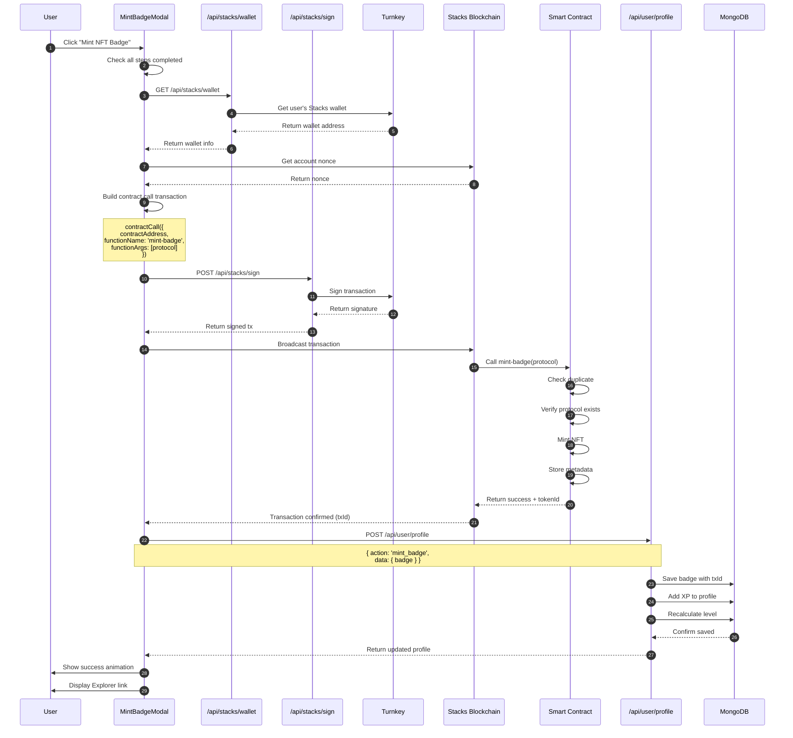
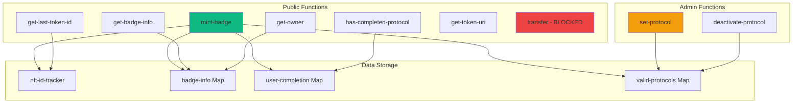
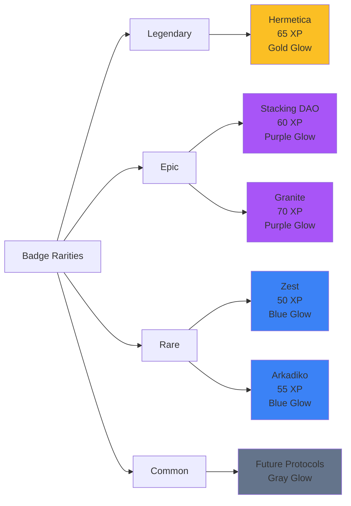
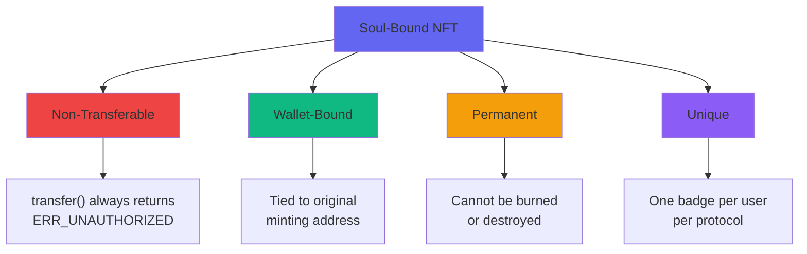
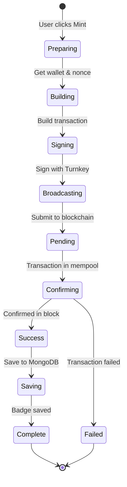
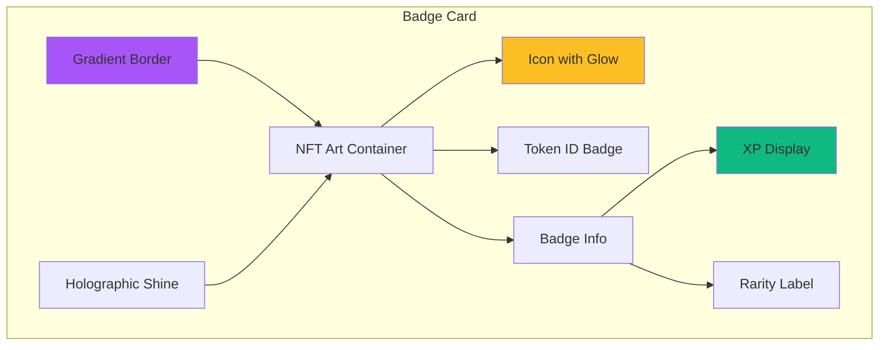
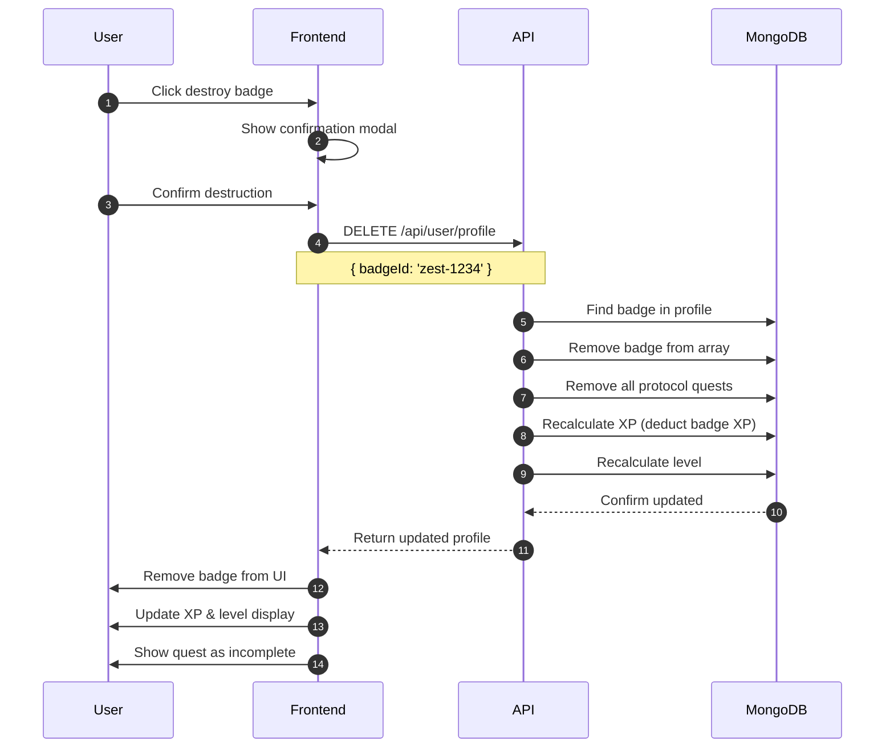

# NFT Badge System Documentation

## Overview

QuestFi uses **soul-bound NFT badges** to reward users for completing protocol quests. These badges are minted on the Stacks blockchain using a custom SIP-009 compliant smart contract.

---

## NFT System Architecture

```mermaid
graph TB
    subgraph "Frontend"
        A[MintBadgeModal]
        B[Badge Gallery]
        C[Profile Dashboard]
    end

    subgraph "API Layer"
        D[/api/stacks/wallet]
        E[/api/stacks/sign]
        F[/api/user/profile]
    end

    subgraph "Turnkey"
        G[Wallet Service]
        H[Transaction Signer]
    end

    subgraph "Stacks Blockchain"
        I[quest-badge-nft Contract]
        J[Stacks API]
    end

    subgraph "Storage"
        K[(MongoDB)]
    end

    A --> D
    D --> G
    A --> E
    E --> H
    A --> J

    J --> I
    I --> J

    A --> F
    F --> K

    B --> F
    C --> F

    style A fill:#6366f1
    style I fill:#10b981
    style K fill:#8b5cf6
    style G fill:#ec4899
```

---

## NFT Minting Flow



---

## Smart Contract Architecture

### Contract: quest-badge-nft.clar



### Data Structures

```clarity
;; NFT ID tracker (auto-increment)
(define-data-var nft-id-tracker uint u0)

;; Badge metadata
(define-map badge-info
  { token-id: uint }
  {
    owner: principal,
    protocol: (string-ascii 50),
    minted-at: uint,
    xp-earned: uint
  }
)

;; User completion tracking
(define-map user-completion
  { user: principal, protocol: (string-ascii 50) }
  { completed: bool }
)

;; Valid protocols configuration
(define-map valid-protocols
  (string-ascii 50)
  {
    active: bool,
    xp-reward: uint,
    name: (string-ascii 100)
  }
)
```

### Key Functions

#### mint-badge

```clarity
(define-public (mint-badge (protocol (string-ascii 50)))
  (let
    (
      (caller tx-sender)
      (new-token-id (+ (var-get nft-id-tracker) u1))
      (protocol-info (unwrap!
        (map-get? valid-protocols protocol)
        ERR_INVALID_PROTOCOL))
    )
    ;; Check protocol is active
    (asserts! (get active protocol-info) ERR_PROTOCOL_INACTIVE)

    ;; Check user hasn't already minted this badge
    (asserts!
      (is-none (map-get? user-completion {user: caller, protocol: protocol}))
      ERR_ALREADY_COMPLETED)

    ;; Mint the NFT
    (try! (nft-mint? quest-badge caller new-token-id))

    ;; Store badge info
    (map-set badge-info
      { token-id: new-token-id }
      {
        owner: caller,
        protocol: protocol,
        minted-at: block-height,
        xp-earned: (get xp-reward protocol-info)
      }
    )

    ;; Mark as completed
    (map-set user-completion
      { user: caller, protocol: protocol }
      { completed: true }
    )

    ;; Increment counter
    (var-set nft-id-tracker new-token-id)

    (ok new-token-id)
  )
)
```

#### transfer (Soul-Bound)

```clarity
(define-public (transfer
  (token-id uint)
  (sender principal)
  (recipient principal))
  ;; Soul-bound: transfers are ALWAYS blocked
  (err ERR_UNAUTHORIZED)
)
```

### Error Codes

| Code | Constant | Description |
|------|----------|-------------|
| u1 | ERR_UNAUTHORIZED | Unauthorized action |
| u2 | ERR_NOT_FOUND | Token not found |
| u3 | ERR_ALREADY_COMPLETED | Protocol already completed |
| u4 | ERR_INVALID_PROTOCOL | Protocol doesn't exist |
| u5 | ERR_PROTOCOL_INACTIVE | Protocol is deactivated |

---

## Badge Properties

### Badge Schema

```typescript
interface Badge {
  id: string                  // "zest-1234"
  protocol: string            // "zest"
  name: string               // "Zest Protocol Master"
  icon: string               // "🏦"
  description: string        // "Completed all Zest Protocol quests"
  xpEarned: number          // 50
  mintedAt: string          // "2024-10-13"
  tokenId: number           // 1234
  rarity: 'common' | 'rare' | 'epic' | 'legendary'
  txId: string              // "0x..." - Blockchain transaction ID
}
```

### Rarity Tiers



### Rarity Configuration

| Rarity | Protocols | Color Gradient | Border | Shadow |
|--------|-----------|----------------|--------|--------|
| **Legendary** | Hermetica | `from-yellow-600 via-yellow-400 to-yellow-600` | `border-yellow-500/50` | `shadow-yellow-500/30` |
| **Epic** | Stacking DAO, Granite | `from-purple-600 via-purple-400 to-purple-600` | `border-purple-500/50` | `shadow-purple-500/30` |
| **Rare** | Zest, Arkadiko | `from-blue-600 via-blue-400 to-blue-600` | `border-blue-500/50` | `shadow-blue-500/30` |
| **Common** | Future protocols | `from-slate-600 via-slate-400 to-slate-600` | `border-slate-500/50` | `shadow-slate-500/30` |

---

## Soul-Bound Properties

### What Makes Them Soul-Bound?



### Transfer Prevention

```clarity
;; This function ALWAYS fails
(define-public (transfer (token-id uint) (sender principal) (recipient principal))
  ;; Soul-bound tokens cannot be transferred
  (err ERR_UNAUTHORIZED)
)
```

**Why Soul-Bound?**
1. **Proof of Learning**: Can't be bought or sold
2. **Authentic Achievement**: Tied to the learner
3. **Non-Gameable**: Must complete quests to earn
4. **Reputation Building**: True reflection of knowledge

---

## Minting Process

### Frontend Implementation

```typescript
// 1. Check eligibility
const allStepsComplete = completedSteps.length === protocol.steps.length
const hasBadge = userBadges.some(b => b.protocol === protocolId)

if (!allStepsComplete || hasBadge) {
  return // Cannot mint
}

// 2. Get wallet from Turnkey
const walletResponse = await fetch('/api/stacks/wallet', {
  headers: { 'x-suborg-id': suborgId }
})
const { address, publicKey } = await walletResponse.json()

// 3. Get account nonce
const nonce = await getNonce(address, network)

// 4. Build transaction
const txOptions = {
  contractAddress: process.env.NEXT_PUBLIC_NFT_CONTRACT_ADDRESS,
  contractName: 'quest-badge-nft',
  functionName: 'mint-badge',
  functionArgs: [stringAsciiCV(protocolId)],
  senderKey: publicKey,
  network,
  anchorMode: AnchorMode.Any,
  nonce,
  fee: 1000,
  postConditionMode: PostConditionMode.Allow,
}

const transaction = await makeContractCall(txOptions)

// 5. Sign with Turnkey
const signResponse = await fetch('/api/stacks/sign', {
  method: 'POST',
  headers: { 'x-suborg-id': suborgId },
  body: JSON.stringify({
    transaction: transaction.serialize().toString('hex')
  })
})
const { signedTransaction } = await signResponse.json()

// 6. Broadcast
const txId = await broadcastTransaction(signedTransaction, network)

// 7. Save to MongoDB
await axios.post('/api/user/profile', {
  action: 'mint_badge',
  data: {
    badge: {
      id: `${protocolId}-${Date.now()}`,
      protocol: protocolId,
      name: `${protocolName} Master`,
      icon: protocolIcon,
      description: `Completed all ${protocolName} quests`,
      xpEarned: protocolXP,
      mintedAt: new Date().toISOString(),
      tokenId: tokenId,
      rarity: getRarity(protocolId),
      txId
    }
  }
}, {
  headers: { 'x-suborg-id': suborgId }
})
```

### Transaction States



---

## Badge Display

### Gallery UI



### Visual Effects

**Animations:**
- Icon floating (3s loop)
- Holographic shine sweep (3s loop)
- Sparkle effects (2s loop)
- Border glow pulse

**Colors per Rarity:**
```typescript
const getRarityColor = (rarity: string) => {
  switch (rarity) {
    case 'legendary': return 'from-yellow-600 via-yellow-400 to-yellow-600'
    case 'epic': return 'from-purple-600 via-purple-400 to-purple-600'
    case 'rare': return 'from-blue-600 via-blue-400 to-blue-600'
    default: return 'from-slate-600 via-slate-400 to-slate-600'
  }
}
```

---

## On-Chain Verification

### Verify Badge Ownership

```typescript
// Query smart contract
const badgeInfo = await callReadOnlyFunction({
  contractAddress: 'ST2F3J1PK46D6XVRBB9SQ66PY89P8G0EBDW5E05M7',
  contractName: 'quest-badge-nft',
  functionName: 'get-badge-info',
  functionArgs: [uintCV(tokenId)],
  network,
  senderAddress: userAddress,
})

// Parse result
const owner = cvToValue(badgeInfo).owner
const protocol = cvToValue(badgeInfo).protocol
const mintedAt = cvToValue(badgeInfo)['minted-at']
```

### Check Protocol Completion

```clarity
(define-read-only (has-completed-protocol
  (user principal)
  (protocol (string-ascii 50)))
  (match (map-get? user-completion {user: user, protocol: protocol})
    completion (get completed completion)
    false
  )
)
```

---

## Badge Management

### Destroy & Retake Quest



### Retake Logic

```typescript
// When badge is destroyed:
// 1. Remove badge from user.badges[]
currentProfile.badges = currentProfile.badges.filter(b => b.id !== badgeId)

// 2. Remove all completed quests for that protocol
currentProfile.completedQuests = currentProfile.completedQuests.filter(
  qId => !qId.startsWith(`${protocolId}-`)
)

// 3. Recalculate XP (only from remaining badges)
currentProfile.totalXP = currentProfile.badges.reduce(
  (total, badge) => total + badge.xpEarned,
  0
)

// 4. Recalculate level from new totalXP
currentProfile.level = calculateLevel(currentProfile.totalXP)
```

---

## Testing

### Smart Contract Tests

```typescript
import { describe, expect, it } from 'vitest'

describe('quest-badge-nft', () => {
  it('should mint badge for valid protocol', () => {
    const { result } = simnet.callPublicFn(
      'quest-badge-nft',
      'mint-badge',
      [Cl.stringAscii('zest')],
      address1
    )
    expect(result).toBeOk(Cl.uint(1))
  })

  it('should prevent duplicate minting', () => {
    // Mint first badge
    simnet.callPublicFn('quest-badge-nft', 'mint-badge',
      [Cl.stringAscii('zest')], address1)

    // Try to mint again
    const { result } = simnet.callPublicFn(
      'quest-badge-nft',
      'mint-badge',
      [Cl.stringAscii('zest')],
      address1
    )
    expect(result).toBeErr(Cl.uint(ERR_ALREADY_COMPLETED))
  })

  it('should block transfers (soul-bound)', () => {
    const { result } = simnet.callPublicFn(
      'quest-badge-nft',
      'transfer',
      [Cl.uint(1), Cl.principal(address1), Cl.principal(address2)],
      address1
    )
    expect(result).toBeErr(Cl.uint(ERR_UNAUTHORIZED))
  })
})
```

---

## Blockchain Explorer Integration

### View Transaction

```typescript
const explorerUrl = network.isMainnet()
  ? `https://explorer.hiro.so/txid/${txId}?chain=mainnet`
  : `https://explorer.hiro.so/txid/${txId}?chain=testnet`

window.open(explorerUrl, '_blank')
```

### View Contract

```
https://explorer.hiro.so/txid/ST2F3J1PK46D6XVRBB9SQ66PY89P8G0EBDW5E05M7.quest-badge-nft?chain=testnet
```

---

## Best Practices

### For Users
1. ✅ Complete all quest steps before minting
2. ✅ Double-check protocol name before minting
3. ✅ Save the transaction ID for your records
4. ✅ Keep badges as proof of learning

### For Developers
1. ✅ Validate all quest steps completed client-side
2. ✅ Check for existing badge before minting
3. ✅ Handle transaction failures gracefully
4. ✅ Store txId with badge in MongoDB
5. ✅ Implement proper error handling
6. ✅ Test on testnet before mainnet deployment

---

## Troubleshooting

**Badge not appearing after mint**
- Check transaction status on explorer
- Wait for blockchain confirmation (1-2 blocks)
- Refresh profile page

**Transaction failed**
- Ensure sufficient STX for fees
- Verify protocol is active
- Check if badge already minted

**Signature error**
- Verify Turnkey credentials
- Check wallet ownership
- Ensure correct network selected

---

This documentation covers the complete NFT Badge System in QuestFi. For authentication details, see [AUTHENTICATION_FLOW.md](AUTHENTICATION_FLOW.md).
