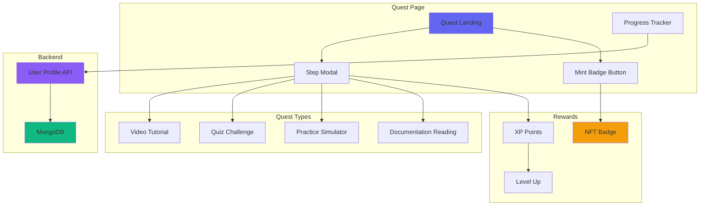
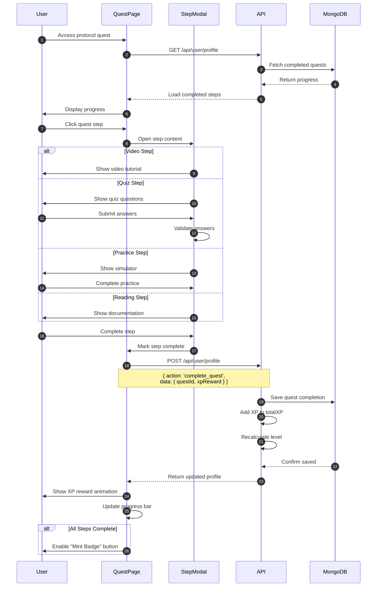
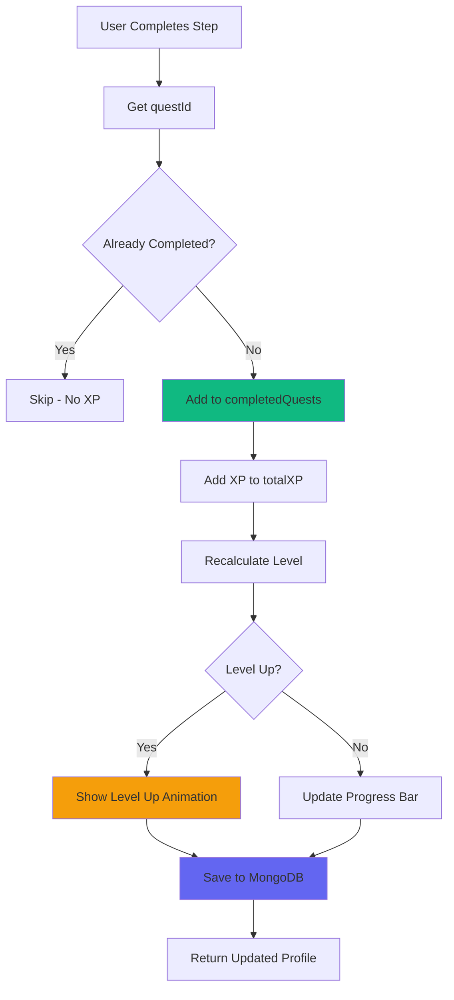
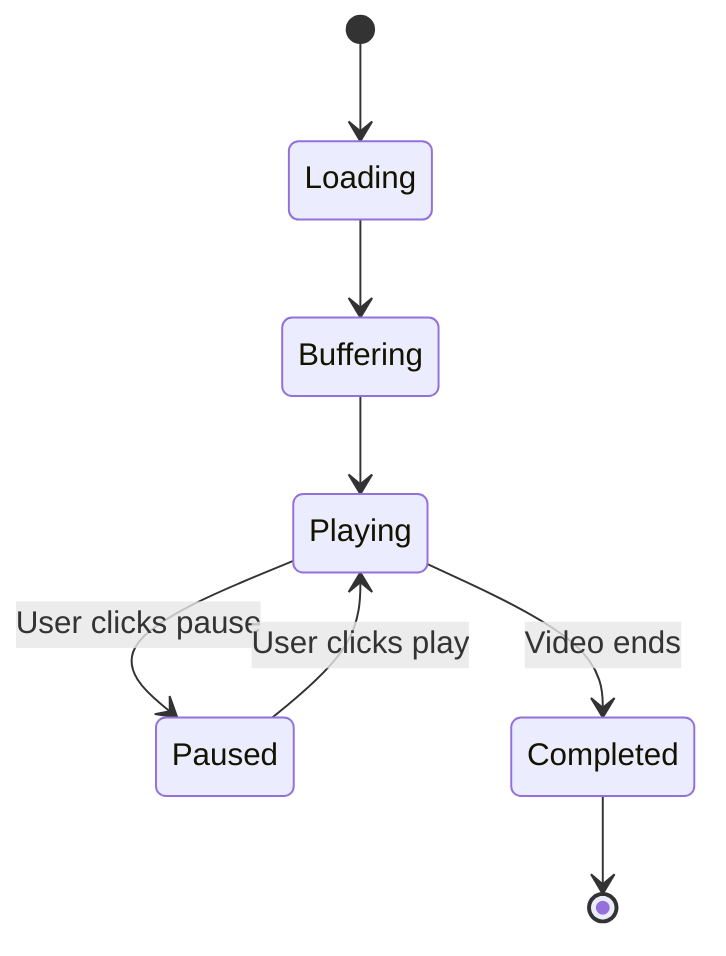
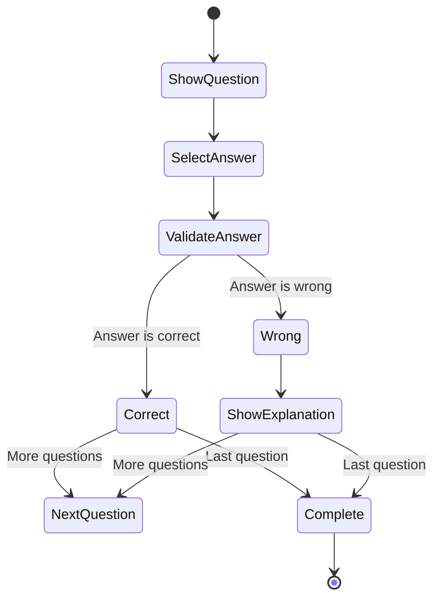
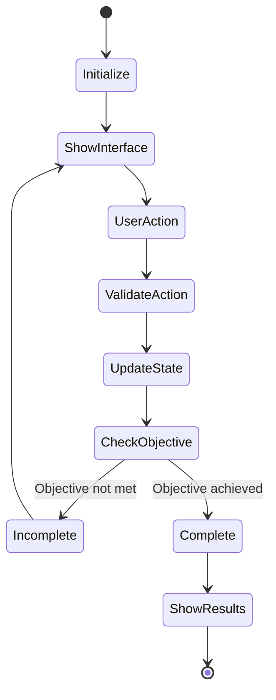
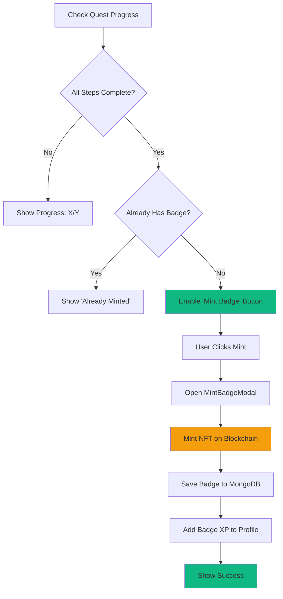
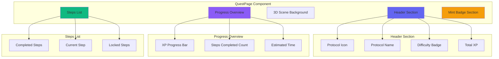
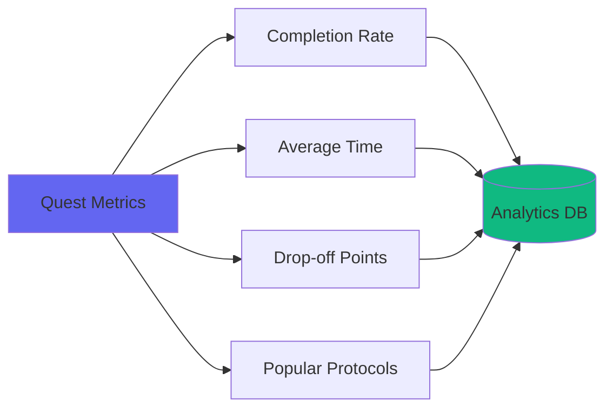

# Quest System Documentation

## Overview

The Quest System is the core learning mechanism of QuestFi, providing interactive, step-by-step tutorials for DeFi protocols on Stacks.

---

## Quest Architecture



---

## Quest Completion Flow



---

## Protocol Structure

### Quest Data Schema

```typescript
interface Protocol {
  id: string                    // "zest", "hermetica"
  name: string                  // "Zest Protocol"
  icon: string                  // "🏦"
  description: string           // Protocol description
  category: string              // "Lending", "Staking"
  difficulty: 'beginner' | 'intermediate' | 'advanced'
  totalXP: number              // Total XP for all steps

  steps: Step[]                 // Quest steps
}

interface Step {
  id: number                    // Step number
  title: string                 // Step title
  type: 'video' | 'quiz' | 'practice' | 'reading'
  xp: number                   // XP reward

  content: {
    // Type-specific content
    videoUrl?: string
    questions?: Question[]
    markdown?: string
    simulator?: SimulatorConfig
  }
}

interface Question {
  question: string
  options: string[]
  correctAnswer: number
  explanation?: string
}
```

### Example Protocol Data

```typescript
export const zestData = {
  id: 'zest',
  name: 'Zest Protocol',
  icon: '🏦',
  description: 'Learn Bitcoin lending and borrowing on Stacks',
  category: 'Lending',
  difficulty: 'intermediate',
  totalXP: 50,

  steps: [
    {
      id: 1,
      title: 'Introduction to Zest',
      type: 'video',
      xp: 5,
      content: {
        videoUrl: 'https://youtube.com/watch?v=...'
      }
    },
    {
      id: 2,
      title: 'Understanding Liquidity Pools',
      type: 'reading',
      xp: 10,
      content: {
        markdown: `# Liquidity Pools\n\nLiquidity pools are...`
      }
    },
    {
      id: 3,
      title: 'Quiz: Test Your Knowledge',
      type: 'quiz',
      xp: 15,
      content: {
        questions: [
          {
            question: 'What is a liquidity pool?',
            options: [
              'A pool of water',
              'A collection of assets locked in a smart contract',
              'A type of wallet',
              'A blockchain network'
            ],
            correctAnswer: 1,
            explanation: 'Liquidity pools are collections of assets...'
          }
        ]
      }
    },
    {
      id: 4,
      title: 'Practice: Deposit Assets',
      type: 'practice',
      xp: 20,
      content: {
        simulator: {
          type: 'deposit',
          initialBalance: 1000,
          assets: ['BTC', 'STX']
        }
      }
    }
  ]
}
```

---

## Progress Tracking

### MongoDB Storage

```typescript
// User profile document
{
  _id: ObjectId,
  suborgId: "user_identifier",

  completedQuests: [
    "zest-step-1",
    "zest-step-2",
    "zest-step-3",
    "hermetica-step-1"
  ],

  totalXP: 1550,
  currentLevelXP: 100,
  level: 7,
  nextLevelXP: 400,

  badges: [
    {
      id: "zest-badge-1",
      protocol: "zest",
      xpEarned: 50,
      mintedAt: "2024-10-13"
    }
  ]
}
```

### Progress Calculation



### Level Calculation Algorithm

```typescript
function calculateLevel(totalXP: number) {
  let level = 1
  let accumulatedXP = 0

  while (true) {
    // Progressive scaling: Each level needs more XP
    const xpForCurrentLevel = 100 + (level - 1) * 50

    if (accumulatedXP + xpForCurrentLevel <= totalXP) {
      accumulatedXP += xpForCurrentLevel
      level++
    } else {
      return {
        level,
        currentLevelXP: totalXP - accumulatedXP,
        nextLevelXP: xpForCurrentLevel
      }
    }
  }
}
```

**XP Progression Table:**

| Level | XP Required | Cumulative XP | Description |
|-------|-------------|---------------|-------------|
| 1→2   | 100         | 100           | Beginner |
| 2→3   | 150         | 250           | Learner |
| 3→4   | 200         | 450           | Student |
| 4→5   | 250         | 700           | Explorer |
| 5→6   | 300         | 1,000         | Practitioner |
| 10→11 | 550         | 3,250         | Expert |
| 15→16 | 800         | 6,500         | Master |
| 20→21 | 1,050       | 11,000        | Grandmaster |

---

## Step Types

### 1. Video Tutorial



**Implementation:**
```typescript
{
  type: 'video',
  content: {
    videoUrl: 'https://youtube.com/watch?v=xyz',
    duration: 300, // seconds
    thumbnail: '/thumbnails/video.jpg'
  }
}
```

### 2. Quiz Challenge



**Implementation:**
```typescript
{
  type: 'quiz',
  content: {
    questions: [
      {
        question: 'What is DeFi?',
        options: [
          'Decentralized Finance',
          'Digital Finance',
          'Defined Finance',
          'Deposit Finance'
        ],
        correctAnswer: 0,
        explanation: 'DeFi stands for Decentralized Finance...'
      }
    ],
    passingScore: 70, // percentage
    attemptsAllowed: 3
  }
}
```

### 3. Practice Simulator



**Simulator Types:**
- **Deposit**: Practice depositing assets
- **Swap**: Practice token swapping
- **Stake**: Practice staking assets
- **Borrow**: Practice borrowing against collateral

**Implementation:**
```typescript
{
  type: 'practice',
  content: {
    simulator: {
      type: 'deposit',
      objective: 'Deposit 100 STX into the pool',
      initialBalance: {
        STX: 1000,
        BTC: 0.5
      },
      hints: [
        'Click the deposit button',
        'Enter the amount',
        'Confirm the transaction'
      ]
    }
  }
}
```

### 4. Reading Documentation

```typescript
{
  type: 'reading',
  content: {
    markdown: `
# Protocol Overview

Detailed explanation of the protocol...

## Key Concepts
- Concept 1
- Concept 2

## How It Works
Step-by-step explanation...
    `,
    estimatedTime: 5 // minutes
  }
}
```

---

## Badge Unlocking

### Completion Check



### Badge Requirements

| Protocol | Steps Required | Total XP | Badge Rarity |
|----------|----------------|----------|--------------|
| Zest | 7 | 50 | Rare |
| Hermetica | 8 | 65 | Legendary |
| Stacking DAO | 6 | 60 | Epic |
| Granite | 7 | 70 | Epic |
| Arkadiko | 6 | 55 | Rare |

---

## UI Components

### Quest Page Structure



### Step States

```typescript
enum StepState {
  LOCKED = 'locked',        // Not yet accessible
  AVAILABLE = 'available',  // Can be started
  IN_PROGRESS = 'progress', // Currently active
  COMPLETED = 'completed'   // Finished
}
```

**Visual Indicators:**
- 🔒 **Locked**: Gray, disabled
- ⭐ **Available**: Blue, clickable
- 🎯 **In Progress**: Yellow, pulsing
- ✅ **Completed**: Green, checkmark

---

## API Integration

### Complete Quest API

```typescript
// POST /api/user/profile
{
  action: 'complete_quest',
  data: {
    questId: 'zest-step-1',
    xpReward: 10
  }
}

// Response
{
  success: true,
  profile: {
    totalXP: 1560,
    currentLevelXP: 110,
    level: 7,
    nextLevelXP: 400,
    completedQuests: [
      'zest-step-1',
      'zest-step-2',
      // ...
    ]
  }
}
```

### Check Badge Eligibility

```typescript
// Check if user can mint badge
const completedStepsCount = profile.completedQuests
  .filter(id => id.startsWith('zest-'))
  .length

const totalSteps = protocol.steps.length
const canMintBadge = completedStepsCount === totalSteps

// Check if already has badge
const hasBadge = profile.badges.some(b => b.protocol === 'zest')
```

---

## Analytics & Tracking

### Quest Metrics



**Tracked Events:**
- Quest started
- Step completed
- Step failed/skipped
- Time spent per step
- Badge minted
- Quest abandoned

---

## Best Practices

### For Quest Creators

1. **Progressive Difficulty**: Start easy, increase complexity
2. **Clear Objectives**: Tell users what they'll learn
3. **Immediate Feedback**: Show results after each action
4. **Engaging Content**: Mix video, reading, and practice
5. **Realistic XP**: Balance rewards with effort required

### For Developers

1. **Save Progress Frequently**: After each step completion
2. **Handle Errors Gracefully**: Network failures, invalid answers
3. **Optimize Load Times**: Lazy load step content
4. **Mobile Responsive**: Ensure all steps work on mobile
5. **Accessibility**: Support keyboard navigation, screen readers

---

## Adding New Protocols

### Step-by-Step Guide

1. **Create Protocol Data**
```typescript
// /frontend/data/newprotocol/newprotocol.tsx
export const newProtocolData = {
  id: 'newprotocol',
  name: 'New Protocol',
  // ... rest of the data
}
```

2. **Add to Protocol Registry**
```typescript
// /frontend/app/quest/[protocol]/page.tsx
const protocolData: any = {
  zest: zestData,
  hermetica: hermeticaData,
  newprotocol: newProtocolData // Add here
}
```

3. **Update Smart Contract**
```clarity
;; Add to contract initialization
(map-set valid-protocols "newprotocol" {
  active: true,
  xp-reward: u60,
  name: "New Protocol Master"
})
```

4. **Test Quest Flow**
- Complete all steps
- Verify XP calculation
- Test badge minting
- Check progress persistence

---

## Troubleshooting

### Common Issues

**Progress Not Saving**
- Check API endpoint is receiving correct headers
- Verify MongoDB connection
- Ensure questId format is correct

**Steps Not Unlocking**
- Verify previous steps marked as complete
- Check step dependency logic
- Clear localStorage and retry

**Badge Button Disabled**
- Confirm all steps completed
- Check if badge already minted
- Verify protocol configuration

---

This documentation covers the complete Quest System in QuestFi. For more details on authentication and NFT minting, see [AUTHENTICATION_FLOW.md](AUTHENTICATION_FLOW.md) and [NFT_SYSTEM.md](NFT_SYSTEM.md).
