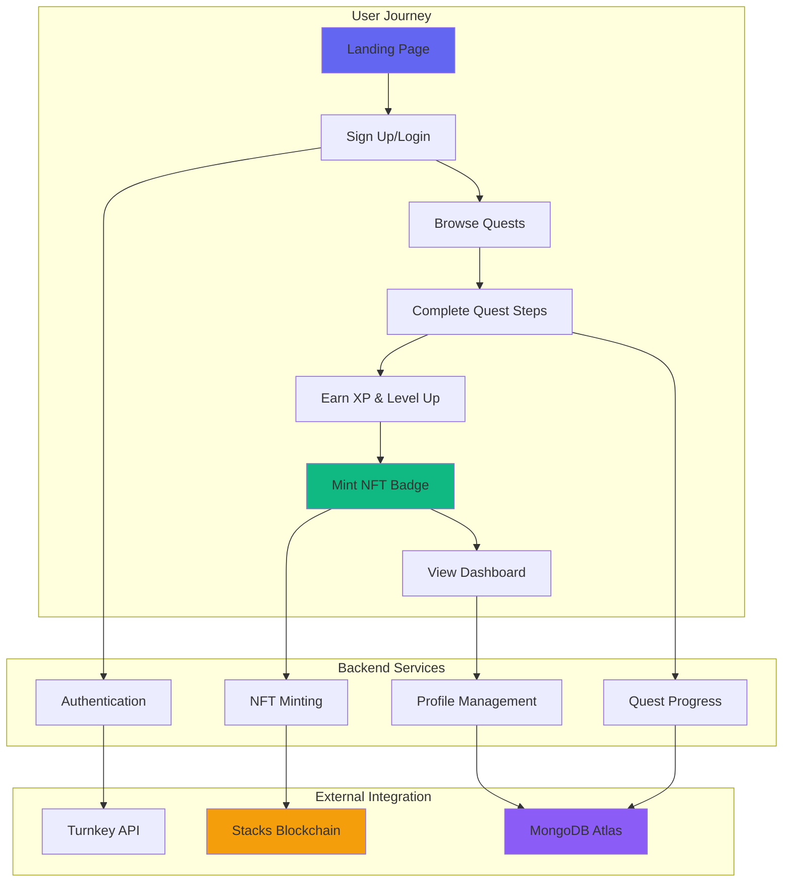
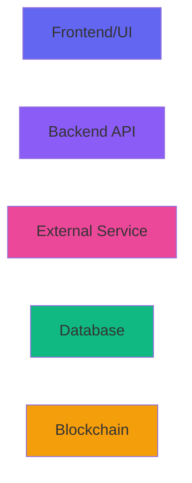
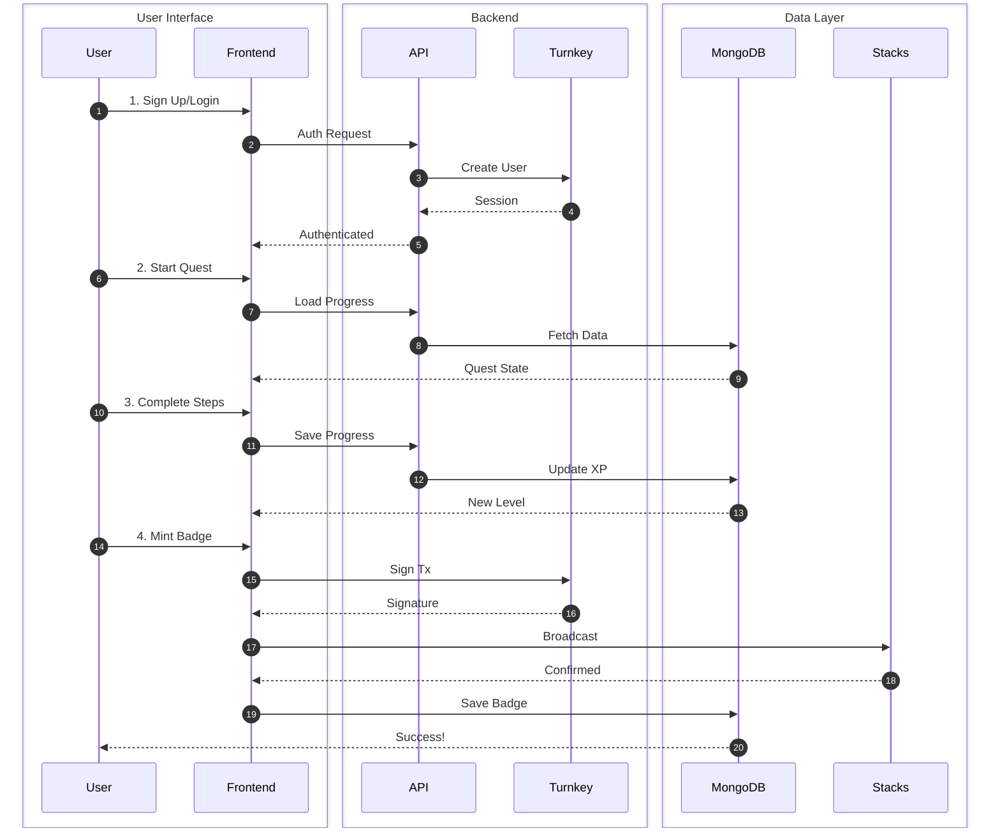
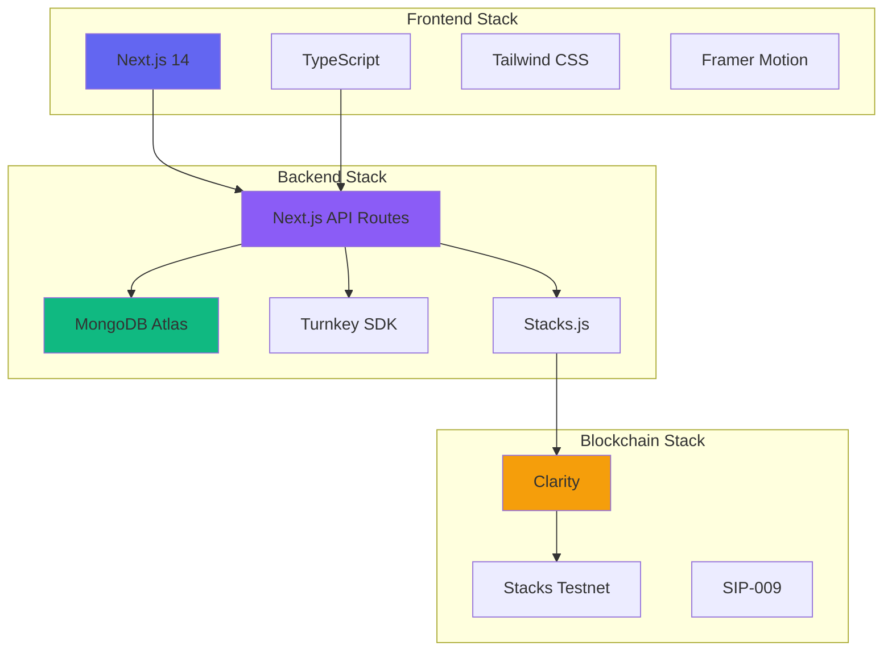
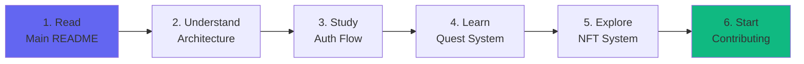

# QuestFi Documentation

Welcome to the comprehensive documentation for **QuestFi** - a gamified DeFi learning platform built on Stacks blockchain.

---

## 📚 Documentation Index

### Getting Started
- **[Main README](../README.md)** - Project overview, quick start, and setup guide
- **[Architecture Overview](ARCHITECTURE.md)** - Technical architecture and project structure

### Core Systems
- **[Authentication Flow](AUTHENTICATION_FLOW.md)** - Complete authentication system with diagrams
  - Email OTP
  - Google OAuth
  - Passkey (WebAuthn)
  - Wallet Connect

- **[Quest System](QUEST_SYSTEM.md)** - Quest mechanics and progression
  - Quest structure
  - Step types (Video, Quiz, Practice, Reading)
  - Progress tracking
  - XP & leveling system

- **[NFT Badge System](NFT_SYSTEM.md)** - Soul-bound NFT badges
  - Smart contract details
  - Minting process
  - Badge properties & rarity
  - On-chain verification

### Additional Documentation
- **[API Reference](API_REFERENCE.md)** - Complete API documentation *(Coming Soon)*
- **[Deployment Guide](DEPLOYMENT.md)** - Production deployment steps *(Coming Soon)*
- **[Contributing Guide](CONTRIBUTING.md)** - How to contribute *(Coming Soon)*

---

## 🗺️ System Overview



---

## 🎯 Quick Navigation

### By Role

**👨‍💻 For Developers**
1. Start with [Main README](../README.md) for setup
2. Read [Architecture](ARCHITECTURE.md) to understand structure
3. Study [Authentication Flow](AUTHENTICATION_FLOW.md) for auth implementation
4. Review [Quest System](QUEST_SYSTEM.md) for quest mechanics
5. Explore [NFT System](NFT_SYSTEM.md) for smart contract details

**🎓 For Learners**
1. Read [Main README](../README.md) overview
2. Check [Quest System](QUEST_SYSTEM.md) to understand quests
3. Learn about [NFT Badges](NFT_SYSTEM.md) you can earn

**🔒 For Security Auditors**
1. Review [Authentication Flow](AUTHENTICATION_FLOW.md) security
2. Examine [NFT System](NFT_SYSTEM.md) smart contract
3. Check [Architecture](ARCHITECTURE.md) for security measures

---

## 📊 Documentation Statistics

| Metric | Count |
|--------|-------|
| Documentation Files | 7 |
| Mermaid Diagrams | 25+ |
| Code Examples | 50+ |
| Total Lines | 3,000+ |
| Covered Topics | 20+ |

---

## 🎨 Diagram Legend

### Node Colors



- **Blue (#6366f1)**: Frontend components
- **Purple (#8b5cf6)**: Backend APIs
- **Pink (#ec4899)**: External services (Turnkey)
- **Green (#10b981)**: Database (MongoDB) / Success states
- **Orange (#f59e0b)**: Blockchain / Warning states
- **Red (#ef4444)**: Error states / Blocked actions

---

## 🔄 Complete System Flow



---

## 💡 Key Concepts

### Authentication
- **Non-Custodial**: Users control their keys via Turnkey
- **Multi-Method**: Email, OAuth, Passkey, Wallet
- **Secure**: JWT tokens, encrypted storage

### Quest System
- **Progressive Learning**: Step-by-step tutorials
- **Multiple Formats**: Video, quiz, practice, reading
- **Persistent Progress**: Auto-save to MongoDB
- **XP Rewards**: Progressive scaling formula

### NFT Badges
- **Soul-Bound**: Cannot be transferred
- **On-Chain**: Permanent proof on Stacks
- **SIP-009**: Standard compliant
- **Rarity Tiers**: Legendary, Epic, Rare, Common

---

## 🛠️ Tech Stack Overview



---

## 📖 Detailed Documentation

### 1. [Authentication Flow](AUTHENTICATION_FLOW.md)

**What's Covered:**
- Complete authentication architecture diagram
- Email OTP flow with sequence diagrams
- Google OAuth implementation
- Passkey (WebAuthn) setup
- Wallet Connect integration
- Session management
- Security best practices

**Diagrams:** 5+ Mermaid diagrams
**Code Examples:** 15+

---

### 2. [Quest System](QUEST_SYSTEM.md)

**What's Covered:**
- Quest architecture and flow
- Step types (Video, Quiz, Practice, Reading)
- Progress tracking mechanism
- XP calculation algorithm
- Level progression system
- MongoDB schema
- UI component structure

**Diagrams:** 10+ Mermaid diagrams
**Code Examples:** 20+

---

### 3. [NFT Badge System](NFT_SYSTEM.md)

**What's Covered:**
- Complete minting flow
- Smart contract architecture
- Soul-bound implementation
- Badge properties and rarity
- On-chain verification
- Transaction signing with Turnkey
- Badge management (destroy & retake)

**Diagrams:** 10+ Mermaid diagrams
**Code Examples:** 15+

---

### 4. [Architecture](ARCHITECTURE.md)

**What's Covered:**
- Complete project structure
- Component hierarchy
- Data flow diagrams
- Database schema
- Environment variables
- Key algorithms
- Deployment architecture

**Diagrams:** 5+ visual diagrams
**Lines:** 300+

---

## 🚀 Getting Started

### Prerequisites
```bash
# Required
- Node.js 18+
- npm or yarn
- MongoDB Atlas account
- Turnkey account
- Clarinet (for contracts)

# Optional
- Git
- VS Code
```

### Quick Start

1. **Clone the repository**
   ```bash
   git clone https://github.com/yourusername/stxFinance.git
   cd stxFinance
   ```

2. **Install dependencies**
   ```bash
   cd frontend && npm install
   cd ../contract && npm install
   ```

3. **Configure environment**
   ```bash
   cp frontend/.env.example frontend/.env
   # Edit .env with your credentials
   ```

4. **Run development server**
   ```bash
   cd frontend && npm run dev
   ```

5. **Visit http://localhost:3000**

For detailed setup instructions, see [Main README](../README.md).

---

## 📞 Support & Resources

### Documentation
- **Main Docs**: You're here! 📚
- **Interactive Docs**: http://localhost:3000/docs (when running)
- **API Docs**: Coming soon

### Code
- **GitHub**: [QuestFi Repository](https://github.com/yourusername/stxFinance)
- **Issues**: [Report bugs](https://github.com/yourusername/stxFinance/issues)
- **Discussions**: [Ask questions](https://github.com/yourusername/stxFinance/discussions)

### Community
- **Discord**: Join our community (link)
- **Twitter**: Follow @QuestFi (link)
- **Blog**: Read latest updates (link)

---

## 🤝 Contributing

We welcome contributions! Here's how to help:

1. **Read the docs** to understand the system
2. **Check issues** for tasks to work on
3. **Fork the repo** and create a feature branch
4. **Write tests** for new features
5. **Submit a PR** with clear description

See [Contributing Guide](CONTRIBUTING.md) for details.

---

## 📝 Documentation Roadmap

### ✅ Completed
- [x] Main README with overview
- [x] Architecture documentation
- [x] Authentication flow diagrams
- [x] Quest system documentation
- [x] NFT system documentation
- [x] Mermaid diagrams throughout

### 🔄 In Progress
- [ ] API reference documentation
- [ ] Deployment guide
- [ ] Contributing guide

### 📅 Planned
- [ ] Video tutorials
- [ ] Interactive examples
- [ ] Troubleshooting guide
- [ ] Performance optimization guide

---

## 🎓 Learning Path

**New to the project? Follow this path:**



1. **Week 1**: Read overview, setup locally, explore UI
2. **Week 2**: Study authentication, try different login methods
3. **Week 3**: Complete a quest, understand XP system
4. **Week 4**: Mint a badge, review smart contract
5. **Week 5**: Pick an issue, make your first contribution

---

## 📄 License

This project is licensed under the MIT License - see the [LICENSE](../LICENSE) file for details.

---

## 🙏 Acknowledgments

- **Stacks Foundation** - Blockchain infrastructure
- **Turnkey** - Secure key management
- **Hiro** - Developer tools and APIs
- **DeFi Protocols** - Educational content partners

---

<div align="center">

**Built with ❤️ for the Stacks ecosystem**

[Main README](../README.md) | [Architecture](ARCHITECTURE.md) | [Auth Flow](AUTHENTICATION_FLOW.md) | [Quest System](QUEST_SYSTEM.md) | [NFT System](NFT_SYSTEM.md)

</div>
